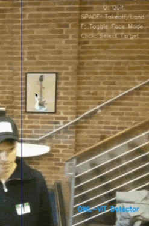

# Project Pigeon

Natural language drone control — chat or voice interface for scanning, targeting, and following people. Built in 24 hours using YOLOv8 + OWL-ViT for open-vocab object tracking.



> Full demo: [`demo.mp4`](media/demo.mp4) · Presentation: [`slides.pdf`](media/slides.pdf)

---

## Features

- **Text and voice commands** - web UI accepts typed or spoken input (e.g. "find the person in the yellow hat")
- **Multi-modal detection** - YOLOv8 for fast bounding boxes, OWL-ViT for text-guided search
- **Precision face lock** - automatically switches to Haar Cascade face tracking once close enough, with a PID control loop
- **ChatGPT integration** - optional; falls back to local command parsing without an API key

---

## Detection pipeline

1. Give a command - the drone takes off and scans using YOLOv8 + OWL-ViT simultaneously
2. An IoU tracker assigns stable IDs across frames
3. Proportional yaw control keeps the target horizontally centered
4. Once a face is large enough in frame, switches to PID-based face tracking for smooth following

---

## Setup

```bash
uv venv && uv pip install -r requirements.txt
# macOS only: brew install portaudio
```

For ChatGPT integration, add `OPENAI_API_KEY` to a `.env` file. Without it, offline command parsing kicks in automatically.

---

## Usage

**Web UI (recommended):**
```bash
uv run python app.py  # open http://localhost:5000
```

**Standalone tracker:**
```bash
uv run python -m drone_tracker.drone_controller      # YOLO
uv run python -m drone_tracker.drone_controller_owl  # OWL-ViT
```
`SPACE` to take off/land · `Q` to quit · click to select a target

---

## Stack

- `djitellopy` - DJI Tello SDK
- `YOLOv8` (Ultralytics) - fast person detection
- `OWL-ViT` (HuggingFace) - text-guided detection
- `OpenCV` - face detection + video I/O
- `Flask` - web interface
- `OpenAI API` - natural language command parsing
